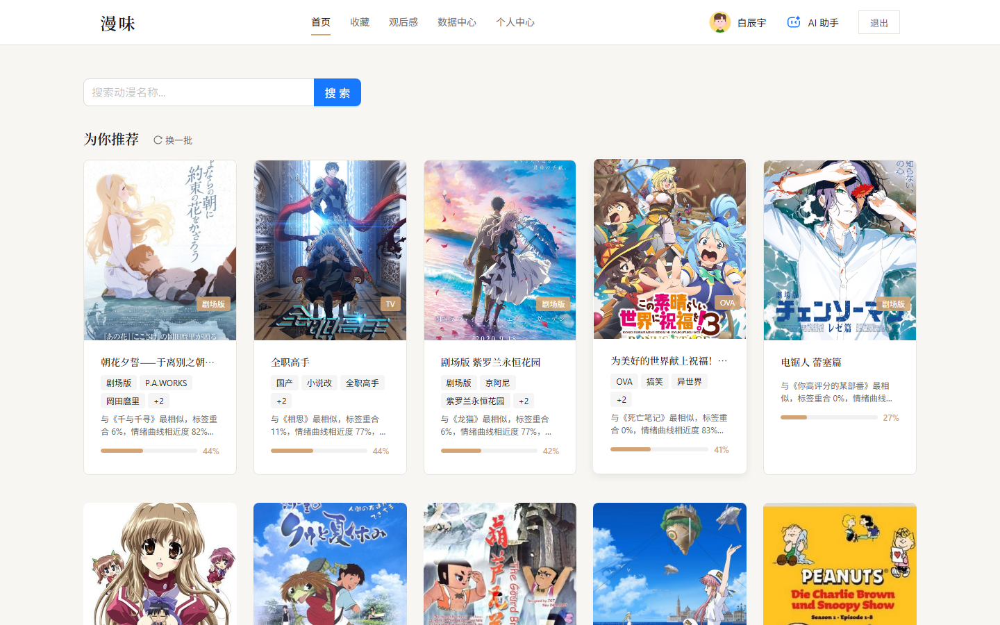
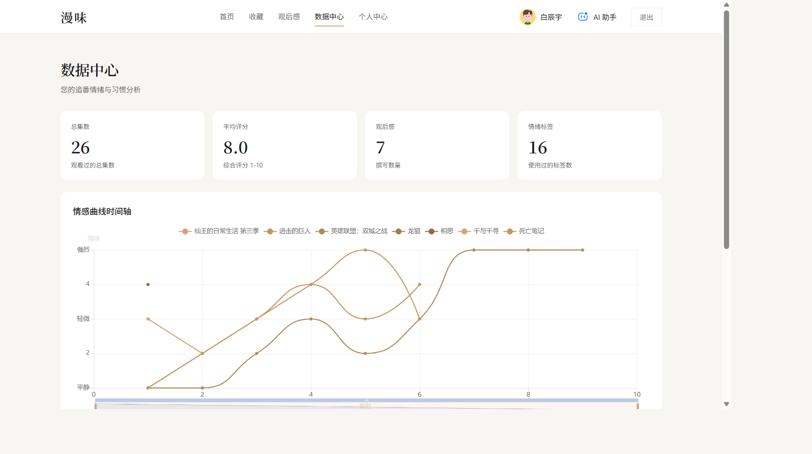
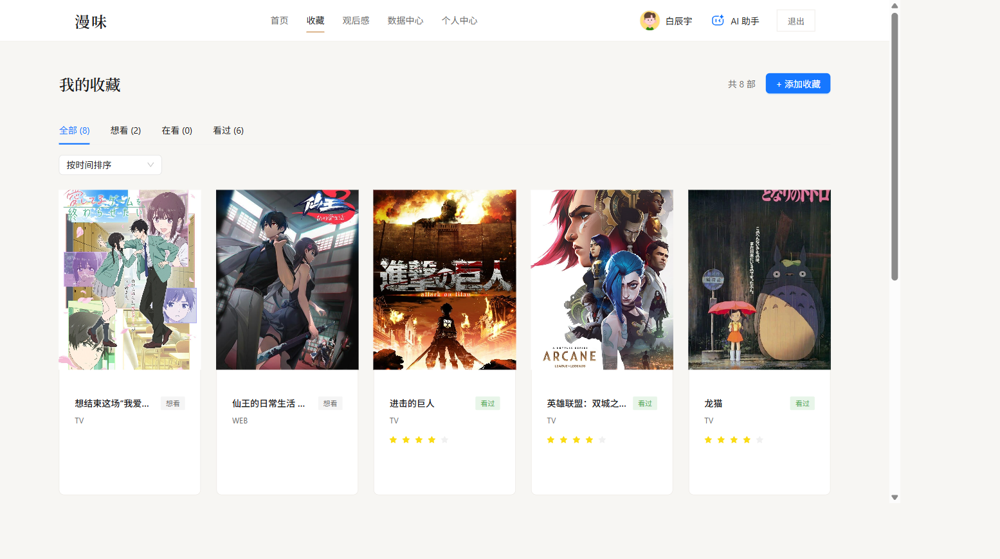

# 漫味 (ManWei) 动漫情感管理平台

> 面向动漫爱好者的情感管理社区，集成 DeepSeek 大模型实现评论情绪自动标注。
> 全程使用 Claude Code 协作开发。

## 📸 项目预览

<table>
  <tr>
    <td align="center"><b>首页</b></td>
    <td align="center"><b>数据中心（ECharts 可视化）</b></td>
  </tr>
  <tr>
    <td></td>
    <td></td>
  </tr>
  <tr>
    <td align="center"><b>收藏页</b></td>
    <td align="center"><b>动漫详情（情绪曲线）</b></td>
  </tr>
  <tr>
    <td></td>
    <td></td>
  </tr>
</table>

## ✨ 项目亮点

- **AI 集成**：自研 AI 助手服务抽象类，支撑管理端 / PC 端 / 小程序端三端复用；为情绪分类设计多版 Prompt 模板
- **跨端开发**：Vue 3 管理后台 + React 19+TS 用户端 + 微信小程序（原生 Canvas 2D 自绘折线图）
- **后端工程**：.NET 8 + EF Core 8 + SQL Server，8 张业务表 / 22 个索引 + 1 个 CHECK 约束（含复合唯一索引）
- **数据采集**：对接 Bangumi V0 REST API（5 个接口），独立处理异构字段与缺失值清洗
- **测试与文档**：12 个功能用例 + 3 个性能用例 + 15+ 份 Markdown 项目文档

## 🛠️ 技术栈

| 端 | 技术 |
|---|------|
| 后端 | ASP.NET Core 8, EF Core 8, SQL Server, DeepSeek API, JWT |
| 管理后台 | Vue 3, Element Plus, ECharts, vue-echarts, Pinia, vue-router |
| PC 用户端 | React 19, TypeScript, Vite, Antd, echarts-for-react, Zustand |
| 微信小程序 | 微信原生, Canvas 2D, vant-weapp |
| 测试 | PowerShell + REST Client + Playwright (E2E) |
| 协作工具 | Git, GitHub, Claude Code + 17 skills |

## 📊 性能基线（实测）

| 接口 | 平均响应 (ms) | p95 (ms) |
|---|---|---|
| GET /api/recommendations | 20 | 14 |
| GET /api/Favorites | 3.6 | 3 |
| GET /api/EmotionCurves/{id} | 2.2 | 2 |
| GET /api/EmotionTags/used | 2.8 | 2 |
| 2 并发 × 5 接口 wall | 1318 | — |
| AI 流式 TTFB | 207 | — |

## 🚀 快速启动

### 后端
```bash
cd backend/ManWei.Api
dotnet restore
dotnet run --launch-profile http
# 后端地址: http://localhost:5150
# Swagger: http://localhost:5150/swagger
```

### 管理后台
```bash
cd frontend/pc-admin
npm install
npm run dev
```

### PC 用户端
```bash
cd frontend/pc-client
npm install
npm run dev
```

### 微信小程序
用微信开发者工具打开 `miniprogram/` 目录即可。

## 📝 项目文档

| 文档 | 说明 |
|---|---|
| [docs/COLLABORATION.md](docs/COLLABORATION.md) | 接口对接文档（前后端协作契约） |
| [docs/recommendation.md](docs/recommendation.md) | 推荐算法方法学（含 Bangumi 标签 + Top-5 投票机制） |
| [docs/ai-assistant-status.md](docs/ai-assistant-status.md) | PC AI 助手实施完成报告 |
| [docs/test-report/](docs/test-report/) | 测试报告（设计/执行/BUG/优化/回归/总结） |
| [docs/PC用户端设计文档.md](docs/PC用户端设计文档.md) | PC 端完整设计文档 |
| [docs/TECH_DEBT.md](docs/TECH_DEBT.md) | 技术债清单 |

## 🐛 踩坑知识库

[CLAUDE.md](CLAUDE.md) 沉淀了 30+ 条项目级调试经验，覆盖：
- DeepSeek tool_call 参数类型转换陷阱
- ECharts-for-weixin 与微信基础库不兼容
- EF Core Migration 双重配置预置 bug
- SQL Server 可空字段唯一索引失效
- Shuffle+OrderByDescending 随机性失效
- BackgroundService + Scoped Service 注入冲突
- Bangumi V0 API 异构 infobox 清洗

## 🧪 测试

```bash
# 37 个 REST Client 请求（VS Code / Rider 打开）
backend/ManWei.Api/tests/api-tests.http

# Playwright E2E（已生成 60+ 页面快照 + 20+ 控制台日志）
.playwright-mcp/
```

## 🏗️ 项目结构

```
ManWei/
├── backend/                          # .NET 8 后端
│   └── ManWei.Api/
│       ├── Controllers/              # 8 个 REST 控制器
│       ├── Services/                 # 13 个业务服务（含 Recommendation/ 子目录 7 个）
│       │   ├── BaseAiAgentService.cs # AI 助手服务抽象类
│       │   ├── BangumiService.cs     # Bangumi API 对接
│       │   └── Recommendation/       # 推荐算法 7 个模块
│       ├── Models/                   # 8 个实体
│       ├── Data/AppDbContext.cs      # EF Core DbContext（22 索引 + 1 CHECK 约束配置）
│       ├── Migrations/               # 13 个 EF 迁移
│       └── tests/api-tests.http      # 37 个 REST Client 请求
├── frontend/                         # 前端
│   ├── pc-admin/                     # Vue 3 管理后台
│   └── pc-client/                    # React 19+TS 用户端
├── miniprogram/                      # 微信小程序
├── docs/                             # 项目文档（Markdown）
│   ├── test-report/                  # 测试报告
│   └── superpowers/                  # 设计 spec + 实施 plan
├── CLAUDE.md                         # 项目级 AI 协作知识库
└── README.md                         # 本文件
```

## 📄 License

MIT
