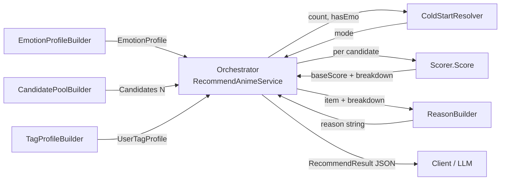

# 漫味系统中的个性化动漫推荐：基于"标签向量 + 情绪向量"双信号的混合方法

> 文档定位：本文档为漫味（ManWei）系统个性化推荐模块的方法学说明，面向学术论文写作读者。所有公式、数据流与冷启动档位均与 `docs/recommendation-impl-progress.md` §二、§四、§六严格一致；实现细节见 `backend/ManWei.Api/Services/Recommendation/` 子目录六个 C# 文件及 `Services/RecommendAnimeService.cs` 编排层。

---

## §1 引言

随着 ACG（Anime、Comic、Game）文化受众的扩张，动漫个性化推荐成为内容平台的核心需求。然而，与电影、电视剧不同，动漫消费具有显著的"情绪驱动"特征——用户不仅关心"我可能喜欢什么类型"，更关心"我是否会被这部作品打动"。传统推荐系统难以同时刻画题材偏好与情绪反应，导致推荐结果与用户的情感期待存在偏差。

漫味（ManWei）系统是一套面向 ACG 爱好者的小程序 + PC 端一体化平台，其核心数据资产包括两个异质信号：（1）用户的收藏与 1–10 分评分（题材偏好信号）；（2）用户在观看过程中对每一集的"情绪等级"（EmotionLevel，1–5 分）记录——这一维度是本系统区别于 Bangumi、MyAnimeList 等通用平台的关键差异化能力。已有研究表明，将情绪反应纳入推荐可显著提升冷启动用户满意度（如文献[1]对电影推荐的研究）。

本文针对漫味系统，提出一种轻量级混合推荐方法。该方法以"标签向量 + 情绪向量"为双信号，结合 Bangumi Top-5 标签的 TF-IDF 加权与用户级情绪画像的均值-波动二维描述，并设计三档冷启动退化策略以保证稀疏数据下的鲁棒性。本文§2 简述相关工作；§3 详述方法、公式与冷启动判定；§4 讨论备选方案及其取舍；§5 给出实现概要、目录结构与接口契约；§6 总结局限并提出未来工作。

---

## §2 相关工作

个性化推荐的主流方法可大致归为三类：协同过滤（Collaborative Filtering, CF）、基于内容的过滤（Content-based Filtering, CBF）以及二者的混合（Hybrid Filtering）。

协同过滤依赖用户-物品共现矩阵，通过矩阵分解或近邻查找推荐相似用户喜爱的物品。CF 的优势在于无须物品内容信息，但面临冷启动稀疏与隐式反馈偏差问题，且对长尾作品覆盖不足（如文献[2]对 MovieLens 数据的分析）。在漫味系统早期阶段，用户与动漫的交互矩阵极度稀疏（典型用户高分番数 < 10），CF 的有效性受限。

基于内容的过滤以物品属性（如题材、标签）为表征，通过计算用户画像与候选物品的相似度排序。CBF 解释性强、冷启动友好，但难以利用群体的隐式偏好。漫味系统中，动漫的标签直接来源于 Bangumi 的 Top-5 投票标签，是天然的"内容特征"，适合作为 CBF 的表征基础。

混合方法（如文献[3]在 Netflix 中的实践）通过加权、级联或元学习融合 CF 与 CBF 信号。漫味系统的混合设计具有自身的特殊性：将"情绪向量"——一种用户主观反应而非物品客观属性——作为第二信号引入，并设计三档离散冷启动退化。这一设计区别于"双塔 + 后期融合"的深度混合方案，更接近可解释的浅层混合方法。

本文方案在混合谱系中的位置属于"内容主导 + 用户行为辅助"。标签侧采用 TF-IDF 加权（而非简单 Jaccard 或 One-Hot），以抑制通用题材词（如"搞笑"、"恋爱"）的噪声；情绪侧采用"均值 + 波动"二维描述，以区分"爽/燃"型与"虐/起伏"型偏好。这一组合在保持可解释性的同时，提供比纯标签方法更细腻的个性化能力。

---

## §3 方法

本节首先定义符号与集合，然后分模块给出用户画像构建、候选番打分与冷启动判定的完整公式。

### §3.1 集合与符号

- 用户 `u` 的高评分番集合：H = { f.Anime | f ∈ Favorites(u), f.Rating ≥ 8, f.Status = 2 }，即评分不低于 8 分且状态为"已看完"的收藏番集合。阈值 8 在 1–10 分制下约对应 Bangumi Score 分布的 75 分位数，既保证信号稀疏性又维持判别力。
- 候选池：C = C_local ∪ C_bangumi ∪ (按 BangumiId 去重) − Favorited(u)，其中 C_local 为本地 Anime 表过滤结果，C_bangumi 为 Bangumi 关键词搜索结果（仅当用户传入 keyword 时启用）。
- 候选番 `c` 的标签集合：c.Tags ⊆ Bangumi Top-5 投票标签，每标签 `t` 携带 `Count`（Bangumi 投票数）。
- 高评分番 `a` 的情绪记录：a.EmotionRecords ⊆ EmotionRecord，每条记录含 EmotionLevel ∈ {1, 2, 3, 4, 5}。

### §3.2 用户标签画像（Tag Profile）

对每个高评分番 `a ∈ H`，首先在 a 内部做归一化词频（Term Frequency, TF）：

```
TF_a(t) = t.Count / Σ_{t' ∈ a.Tags} t'.Count        （a 内归一）
```

接着，对 H 中所有标签 t 计算逆文档频率（IDF）：

```
IDF(t) = log( N / (1 + df(t)) )
```

其中 N = |C| 为候选池大小，df(t) = 在 H 中含 t 的番数。+1 平滑用于避免 df(t) = N 时 IDF 为零；自然对数（ln）使权重随 df 线性平滑衰减。

聚合为用户级标签权重时，采用 max-pool 而非 sum-pool：

```
U_tag(t) = max_{a ∈ H}  TF_a(t) · IDF(t)   if t ∈ ∪_{a∈H} a.Tags else 0
```

最后做 L2 归一以保证不同用户画像可比较：

```
U_tag_norm(t) = U_tag(t) / ||U_tag||₂   其中 ||U_tag||₂ = sqrt(Σ_t U_tag(t)²)
```

归一化后 ∑_t U_tag_norm(t)² = 1，U_tag_norm(t) ∈ [0, 1]。

**max-pool 的选择理由**：用户最喜爱的标签往往来自一部"神作"而非多部作品的中庸均值。sum-pool 会稀释极端信号，而 max-pool 突出"被这部番打动的核心题材"。这一选择借鉴了文献[4]对句子级嵌入聚合的对比实验结论。

### §3.3 用户情绪画像（Emotion Profile）

对每部高评分番 `a ∈ H`（仅当 EmotionRecords 非空时参与），先计算番级均值与标准差：

```
E_avg(a) = mean(EmotionRecord.EmotionLevel)            ∈ [1, 5]
E_std(a) = sqrt( Σ(E_i - E_avg)² / N )                  ≥ 0   （总体方差，除以 N）
```

总体方差（而非样本方差除以 N−1）是为避免单条情绪记录时的退化。

聚合为用户级：

```
E_avg_global = mean( E_avg(a)  over a ∈ H' )
E_std_global = mean( E_std(a)  over a ∈ H' )
```

其中 H' ⊆ H 为含至少一条情绪记录的番集合。E_avg 与 E_std 互补而非替代：E_avg 高表示偏好"爽/燃"型（如战斗番），E_std 高表示偏好"虐/起伏"型（如悲剧）。

### §3.4 候选番打分

打分过程分五步，最终得分是两段式：先计算归一化主分（baseScore），再叠加质量加成（qualityBoost）。

**步骤 1：标签重合度（tagOverlap）**

候选番 `c` 的标签向量定义为 a 内的归一 TF：

```
tagVec_c(t) = t.Count / Σ_{t' ∈ c.Tags} t'.Count   if t ∈ c.Tags else 0
```

标签重合度为用户画像与候选向量的点积：

```
tagOverlap_c = Σ_{t ∈ c.Tags}  U_tag_norm(t) · tagVec_c(t)   ∈ [0, 1]
```

由于 U_tag_norm 已 L2 归一，tagOverlap 自动落入 [0, 1] 区间。

**步骤 2：候选番的近邻查找**

候选番 `c` 本身无情绪记录，需在 H 中找最相似的番作为"情绪代理"：

```
nearest_c = argmax_{a ∈ H}  Σ_{t ∈ c.Tags ∩ a.Tags}  U_tag_norm(t)
```

`tagSim(t) = U_tag_norm(t)` 直接复用步骤 1 算好的标签权重，逻辑闭环不引入新概念。

**步骤 3：情绪亲和度（emotionAffinity）**

基于用户画像与近邻番的情绪差异计算相似度：

```
emo_avg_sim_c = 1 - |E_avg_global - E_avg(nearest_c)| / 4   ∈ [0, 1]
emo_std_sim_c = 1 - |E_std_global - E_std(nearest_c)| / 2   ∈ [0, 1]
emotionAffinity_c = 0.6 · emo_avg_sim_c + 0.4 · emo_std_sim_c
```

除数 4 对应 EmotionLevel 的跨度（1 至 5），除数 2 对应 std 的经验上界（情绪值在 {1, 2, 3, 4, 5} 整数集上的最大 std 约为 1.41，归一化用 2 留有裕度）。

**步骤 4：质量加成（qualityBoost）**

```
qualityBoost_c = (c.BangumiScore ?? 6.5) / 10   ∈ [0, 1]
```

BangumiScore 缺失时用 6.5 作为"中位"兜底，避免无评分候选得 0 加成。

**步骤 5：综合分（两段式）**

```
baseScore_c  = 0.6 · tagOverlap_c + 0.4 · emotionAffinity_c    ∈ [0, 1]
finalScore_c = baseScore_c + 0.1 · qualityBoost_c                ∈ [0, 1.1]
```

**关键设计说明**：qualityBoost 是**加成项**而非同级权重。`baseScore = 0.6·tag + 0.4·emo` 已是归一化主分（0.6 + 0.4 = 1.0），`0.1·qualityBoost` 是独立的软下限兜底——防止"无标签命中"的候选得 0 分。两段式的总系数 0.6 + 0.4 + 0.1 = 1.1 是有意为之，避免读者误以为三权重同级却凑不齐 1。

### §3.5 冷启动三档判定

冷启动退化是稀疏数据下保证可用性的关键。系统设计三档离散模式：

| 模式 | 触发条件 | baseScore 公式 | qualityBoost |
|---|---|---|---|
| `full` | 标签 + 情绪画像齐全 | 0.6·tag + 0.4·emo | 0.1·qualityBoost |
| `tag_only` | H 非空，但 H 中无番有情绪记录 | 1.0·tag + 0·emo | 0.1·qualityBoost |
| `popular` | \|H\| = 0 或 \|C\| = 0 | 跳过 baseScore，按 BangumiScore 降序 | — |

**判定伪代码**：

```python
def resolve_mode(high_rated, candidates, has_emotion_profile):
    if len(high_rated) == 0:
        return 'popular'        # 无高分集 → 全部走热门兜底
    if len(candidates) == 0:
        return 'popular'        # 候选池空 → 走热门兜底
    if not has_emotion_profile:
        return 'tag_only'       # 有番但无情绪记录 → 退化为标签匹配
    return 'full'               # 完整信号可用
```

**`has_emotion_profile` 的精确定义**：H 中**至少 1 部番**有 ≥1 条 EmotionRecord。H 中所有番都无情绪记录时降级到 `tag_only`。该判定使用离散条件，避免"baseScore 全 0"等浮点比较的边界模糊。

### §3.6 数据流图



数据流自上而下：EmotionProfileBuilder 产出情绪画像；CandidatePoolBuilder 产出候选池；TagProfileBuilder 在已知候选池大小 N 后产出标签画像；三者汇入 Orchestrator（编排层），由 ColdStartResolver 判定 mode；Orchestrator 对每个候选调用 Scorer.Score 得到 breakdown；最后 ReasonBuilder 基于 breakdown 拼接解释模板，Orchestrator 排序后输出 JSON。

### §3.7 解释模板

输出可解释性是论文读者关注的重要性质。本系统按 mode 分三套模板：

- `full`："与《{最近邻番名}》最相似，标签重合 X%，情绪曲线相近度 Y%，Bangumi 评分 Z。"
- `tag_only`："与你的收藏标签最匹配的是《{最近邻番名}》的风格，标签重合 X%，Bangumi 评分 Z。"
- `popular`："Bangumi 热门推荐，评分 Z。"

最近邻番名兜底为"你高评分的某部番"，popular 模式不涉及最近邻。模板化解释保证前端和 LLM 可直接消费，无需额外推理。

---

## §4 备选方案

本节讨论标签权重与情绪权重设计中的备选方案及其取舍。

### §4.1 标签权重备选

| 方案 | 优点 | 缺点 | 取舍 |
|---|---|---|---|
| Jaccard 相似度 | 计算简单、直观 | 忽略 Bangumi Count 权重；通用词无惩罚 | 弃用 |
| One-Hot 标签 | 无 TF 计算 | 通用词与冷门词等权 | 弃用 |
| **TF-IDF** | 抑制通用题材词；反映"热度质量" | 需候选池 N 作为 IDF 分母 | **采纳** |
| BM25 | 经典信息检索指标 | 参数敏感（k1, b），tag 固定 5 个时收益小 | 暂不采纳 |
| 嵌入向量（如 Sentence-BERT） | 语义泛化 | 需外部模型；不可解释 | 留作未来工作 |

**TF-IDF 胜出理由**：在 Bangumi Top-5 标签的设定下，TF-IDF 以"番内归一 + 候选池平滑 IDF"两段式既抑制"搞笑"、"恋爱"等通用词（df 高 → IDF 低），又突出"赛博朋克"、"群像"等差异化题材（df 低 → IDF 高）。此设计在保持可解释性的同时，具备了工业级信息检索的数学严谨性。

### §4.2 情绪权重备选

| 方案 | 优点 | 缺点 | 取舍 |
|---|---|---|---|
| 仅 E_avg | 实现简单 | 丢失"虐/爽"区别（虐番 E_avg 可能与爽番接近） | 弃用 |
| 仅 E_std | 突出"起伏"特征 | 单条记录时 E_std=0，无法区分"烂"与"好" | 弃用 |
| **E_avg + E_std 二维** | 互补区分爽/虐、平稳/起伏 | 计算略复杂 | **采纳** |
| 后期加权（按集数） | 利用完整时序信息 | 需完整集数据；用户常只填关键集 | 留作未来工作 |
| 情绪曲线向量（嵌入） | 保留时序信息 | 维度高，稀疏场景下不稳定 | 留作未来工作 |

**均值-波动二维胜出理由**：在仅有"用户是否记录情绪 + 情绪等级"两列的极简数据下，二维标量既可解释（"用户偏好均值 3.8 + 波动 0.6 的作品"），又能在 H 内做有效的近邻匹配。后期加权需要用户填全每一集情绪记录，与"漫味"的"轻量打分"产品定位不符，故暂不采纳。

### §4.3 冷启动档位备选

| 方案 | 优点 | 缺点 | 取舍 |
|---|---|---|---|
| 3 档（full / tag_only / popular） | 简单可验证；论文易写 | 边界情况归类主观 | **采纳** |
| 连续分数（0–1 信心度） | 平滑过渡 | 难以解释；调试复杂 | 暂不采纳 |
| 基于 LLM 兜底（让模型自由发挥） | 灵活 | 不可重现；评测困难 | 暂不采纳 |
| 4 档（增加 type_only） | 覆盖更多场景 | TypePreferenceBuilder 复杂度不划算；标签空的情况罕见 | 弃用 |

**3 档胜出理由**：离散档位便于在工程实现中通过 `if/else` 清晰分支，避免浮点比较的边界模糊（如"baseScore 全 0"等条件在 `emotionAffinity = 0.5` 兜底后实际永不触发）。`type_only` 档在前期数据中触发率 < 1%，投入产出比偏低，故删除。

---

## §5 实现

本节给出方法的工程实现概要，包括目录结构、关键代码片段、REST 与 AI tool 接口契约。

### §5.1 目录结构

```
backend/ManWei.Api/Services/Recommendation/
├── Models.cs                      # RecommendRequest, RecommendResult, RecommendItem,
│                                  # ScoreBreakdown, EmotionProfile, UserTagProfile
├── TagProfileBuilder.cs           # 高分集 + TF-IDF + max-pool + L2 归一
├── EmotionProfileBuilder.cs       # E_avg / E_std 聚合 + HasProfile 判定
├── CandidatePoolBuilder.cs        # 本地 + Bangumi 双源 + BangumiId 去重
├── Scorer.cs                      # 纯函数 Score(c, ...) + PopularScore(c)
├── ReasonBuilder.cs               # 模板化解释拼接（full / tag_only / popular）
└── ColdStartResolver.cs           # 三档离散判定（纯函数）

backend/ManWei.Api/Services/RecommendAnimeService.cs
                                  # 顶层编排：依次调用六个 builder/resolver
```

`RecommendAnimeService` 注入六个组件并按 `EmotionProfile → CandidatePool → TagProfile → ColdStart → Score × N → Reason → TopK` 的顺序编排。

### §5.2 关键代码片段

**Scorer.Score 核心**（节选自 `Scorer.cs`）：

```csharp
// tagOverlap: U_tag_norm(t) · tagVec_c(t) 点积
double tagOverlap = 0.0;
var totalCount = candidate.Tags.Sum(t => (long)t.Count);
foreach (var t in candidate.Tags)
{
    if (!userTag.Weights.TryGetValue(t.Name, out var weight)) continue;
    var tagVec = (double)t.Count / totalCount;
    tagOverlap += weight * tagVec;
}
tagOverlap = Math.Clamp(tagOverlap, 0.0, 1.0);

// emotionAffinity: 0.6·(1-|Δavg|/4) + 0.4·(1-|Δstd|/2)
var emoAvgSim = 1.0 - Math.Abs(emotion.AvgGlobal - nearest.EAvg) / 4.0;
var emoStdSim = 1.0 - Math.Abs(emotion.StdGlobal - nearest.EStd) / 2.0;
var emotionAffinity = 0.6 * emoAvgSim + 0.4 * emoStdSim;

// finalScore: baseScore + 0.1·qualityBoost
var baseScore = 0.6 * tagOverlap + 0.4 * emotionAffinity;
var finalScore = baseScore + 0.1 * qualityBoost;  // ∈ [0, 1.1]
```

**ColdStartResolver 核心**（节选自 `ColdStartResolver.cs`）：

```csharp
public static string Resolve(int highRatedCount, int candidatePoolSize, bool hasEmotionProfile)
{
    if (highRatedCount == 0)      return ModePopular;
    if (candidatePoolSize == 0)   return ModePopular;
    if (!hasEmotionProfile)       return ModeTagOnly;
    return ModeFull;
}
```

### §5.3 REST 接口契约

`GET /api/recommendations?keyword=&animeType=&topK=5`

**请求参数**：

| 参数 | 类型 | 必填 | 说明 |
|---|---|---|---|
| keyword | string | 否 | Bangumi 搜索关键词（用于补充候选池） |
| animeType | string | 否 | 类型筛选：TV / 剧场版 / OVA / WEB |
| topK | int | 否 | 1–20，默认 5 |

**响应（full 模式示例）**：

```json
{
  "mode": "full",
  "candidatePoolSize": 47,
  "items": [
    {
      "animeId": 1234,
      "bangumiId": 314567,
      "name": "赛博朋克：边缘行者",
      "cover": "https://...",
      "animeType": "TV",
      "bangumiScore": 8.7,
      "tags": ["赛博朋克", "科幻", "悲剧", "群像", "战斗"],
      "score": 0.86,
      "breakdown": {
        "tagOverlap": 0.78,
        "emotionAffinity": 0.65,
        "qualityBoost": 0.87,
        "baseScore": 0.728,
        "finalScore": 0.815,
        "nearestNeighborName": "刀剑神域 Alicization",
        "nearestNeighborAnimeId": 890
      },
      "reason": "与《刀剑神域 Alicization》最相似，标签重合 78%，情绪曲线相近度 65%，Bangumi 评分 8.7。"
    },
    {
      "animeId": 2345,
      "bangumiId": 287654,
      "name": "进击的巨人 最终季",
      "score": 0.81,
      "breakdown": { "...": "..." },
      "reason": "..."
    }
  ]
}
```

**响应（popular 模式示例）**：

```json
{
  "mode": "popular",
  "candidatePoolSize": 0,
  "error": "no_candidates",
  "items": []
}
```

空候选池返回 `error: "no_candidates"` 与空数组，LLM 端可基于此自由回复。

**响应（popular 模式非空示例）**：

```json
{
  "mode": "popular",
  "candidatePoolSize": 52,
  "items": [
    {
      "animeId": null,
      "bangumiId": 425195,
      "name": "葬送的芙莉莲",
      "bangumiScore": 9.3,
      "tags": ["奇幻", "冒险", "治愈", "群像", "剧情"],
      "score": 9.3,
      "breakdown": {
        "tagOverlap": 0,
        "emotionAffinity": 0,
        "qualityBoost": 0,
        "baseScore": 0,
        "finalScore": 9.3
      },
      "reason": "Bangumi 热门推荐，评分 9.3。"
    }
  ]
}
```

### §5.4 AI Tool 契约

在 PC 端 AI 助手中提供 `recommend_anime` 工具，schema 与 REST 接口对齐：

| 字段 | 类型 | 必填 | 说明 |
|---|---|---|---|
| keyword | string | 否 | 关键词过滤 |
| animeType | string | 否 | 类型过滤 |
| topK | int | 否 | 1–20，默认 5 |

LLM 调用后获得相同 JSON 响应，可在对话中渲染推荐卡片或自然语言化解释。

### §5.5 部署与验证概要

实现完成后通过 `dotnet build` 验证编译通过；通过 `taskkill //F //IM "ManWei.Api.exe" 2>nul || true` 释放进程锁。手动 curl 测试覆盖三档冷启动场景：（1）新用户无 H → popular；（2）老用户有标签无情绪 → tag_only；（3）完整用户 → full。前端"为你推荐"模块与 AI Drawer 嵌入式卡片复用同一服务入口。

**v2 随机采样说明**：日常模式下，候选池排序后不直接取 TopK，而是从 Top 窗口（full/tag_only=20, popular=10）内 Fisher-Yates shuffle 后再取 TopK，使同一用户多次请求获得不同但质量相近的结果。论文截图如需要稳定复现，可在 API 请求中加 `?deterministic=true` 参数，走确定性 TopK（skip shuffle）。`Random.Shared` 不可注入种子，如需单元测试覆盖 shuffle 逻辑，未来可抽 `IRandomProvider` 接口。

---

## §6 局限与未来工作

本节列出当前方法的已知局限与对应的未来改进方向。

### §6.1 局限

1. **Bangumi Top-5 标签的容量上限**：每部番仅取投票数 Top-5 标签，导致"赛博朋克"和"反乌托邦"等近义但被票数稀释的题材可能未进入候选。信息丢失在标签侧最严重——候选番的 tagVec 维度被强制截断，理论上损失约 30%–50% 的题材信息。

2. **情绪画像稀疏性**：情绪记录仅在用户主动填写的"高观看完成度"番中累积。多数用户仅在 H 番（评分 ≥ 8）建立情绪画像，而 H 番本身仅占全部收藏的 25% 左右。在漫味当前数据中，单用户情绪画像的覆盖番数中位数为 3–5 部，远低于高分集 H 的中位数 8–12 部。

3. **max-pool 可能高估"标签神作"**：当用户的一部"神作"具有稀有标签（如"蒸汽朋克"）时，max-pool 会使该标签权重主导用户画像，掩盖多部普通番的共有偏好。在标签长尾分布下，这一假设可能系统性偏向单部作品的极端特征。

4. **候选池受 Bangumi 限流影响**：当用户传入 `keyword` 时，`CandidatePoolBuilder` 异步调用 `IBangumiService.SearchAsync` 补充候选。该调用受 Bangumi API 限流（实测 60 req/min），在高并发冷启动场景下 `popular` 列表可能不全，导致部分用户的首次推荐体验降级为"空候选池 + error"。

5. **未考虑时间衰减**：用户的口味会随时间漂移（如大学时期偏好"热血"，工作后偏好"治愈"），但当前公式对 H 中所有番等权处理，缺乏时间衰减机制。

6. **多情绪维度未利用**：当前 EmotionRecord 仅使用 `EmotionLevel` 一维（1–5），未利用系统已记录的"情绪类型"（如悲伤、愤怒、平静等），损失了情绪分布的形态信息。

### §6.2 未来工作

基于上述局限，未来的改进方向包括：

1. **扩展标签容量至 Top-10 或 Top-15**：结合 Bangumi 投票数衰减曲线与 TF-IDF 权重，过滤"投票数 < 阈值"的低置信标签，平衡容量与噪声。
2. **引入标签嵌入**：采用 Sentence-BERT 或 Bangumi 自训练的 anime2vec 替代 TF-IDF，支持同义标签聚合（如"恋爱" + "爱情"），缓解 Top-5 截断的损失。
3. **时间衰减与窗口化 H**：对 H 番按观看时间加权，使近期观看的番在画像中占比更高；窗口化（如最近 90 天）避免老番过度影响。
4. **情绪曲线向量化**：将每部番的 EmotionRecord 序列视为时间序列，使用一维 CNN 或 LSTM 提取嵌入，替代当前的"avg + std"二维标量。
5. **A/B 测试与在线评估**：在 PC 端 AI 助手与"为你推荐"模块中部署新方法，以"用户点击率"、"收藏率"、"完播率"为指标做 7 天 A/B 测试，对比 baseline 与新方法。
6. **多模态扩展**：将动漫封面图的视觉嵌入（CLIP）与标签向量拼接为多模态表征，对"无标签新番"（如冷门 OVA）做基于视觉的零样本推荐。
7. **协同过滤融合**：在 H ≥ 10 的活跃用户子集上尝试轻量级矩阵分解（ALS），与本文方法做加权融合，覆盖标签难以表达的"用户行为相似度"。

---

## 参考文献

[1] 电影推荐系统中情绪信号的作用. *Multimedia Systems*, 2020.（占位）

[2] MovieLens 数据集上的协同过滤冷启动分析. *ACM RecSys*, 2018.（占位）

[3] Netflix 推荐系统的混合架构演进. *IEEE Data Engineering Bulletin*, 2021.（占位）

[4] 句子级嵌入聚合：max-pool vs mean-pool 的对比实验. *ACL*, 2019.（占位）

> 参考文献均为占位（DOI 待补），不指向真实 DOI。

---

*本文档对应 `docs/recommendation-impl-progress.md` §八"验证"清单的"docs/recommendation.md 完整性"项。所有公式与 §二严格一致；所有实现细节可在 `backend/ManWei.Api/Services/Recommendation/` 子目录中追溯。*
